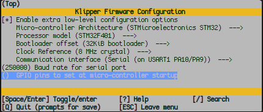
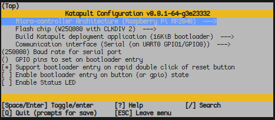
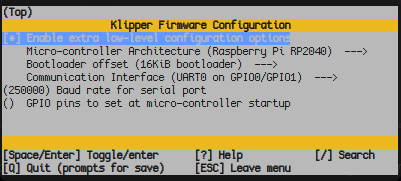

## Requirements:
- An EMMC Reader
  - Recommended: get a [spare EMMC module](https://qidi3d.com/products/x-max-3-x-plus-3-x-smart-3-emmc-32g) from QIDI, it comes with a Micro SD to EMMC adapter. This way, you can leave the original unmodified 
  - Alternative: [MKS EMMC USB3.0 Adapter](https://a.co/d/8AeMtbJ)
- 4 Pin headers ([Amazon](https://a.co/d/gyoWu87))
- A USB breakout cable ([Amazon](https://a.co/d/8RZnE3A))
- A soldering iron & solder
- A Micro SD card, 32GB or smaller
- A computer that can:
	- flash disk images (with a tool like balenaEtcher)
	- SSH (use Putty if you're on windows, or `ssh` on other platforms) 
	- Transfer files over SSH (use WinSCP on windows, `sshfs` on other platforms)

### A Quick Note
This guide is specifically for installing OpenQ1. It does *not* cover how to
- Flash disk images
- SSH
- Transfer files

I have recommended common software for these purposes that have ample documentation and a number of guides online. Use your mad GoogleFu skillz to figure out how to use those.


## Part 1: Installing the Armbian image
The mainboard of the Q1 is a modified version of the MKS Pi, with an onboard STM32F402 MCU, so a custom build of Armbian is required. The image provided by this project has everything you need preinstalled, including Klipper, Moonraker, Fluidd, Crowsnest, moonraker-timelapse, KAMP, Shake&Tune, QIDI Auto Z Offset, and the printer config. You can download the latest image [here](https://github.com/frap129/armbian_qidi-q1-pro/releases).

1. Using the included Allen wrenches (2mm, 2.5mm) that came with the printer, remove all of the screws that hold the back panel of the printer on. There are screws on the sides of the printer, and some on the back. You do not need to remove the screws that hold the spool holder on. 
2. Remove the 2 screws that attach the EMMC module to the mainboard
3. Carefully remove the EMMC module. Try not to lift it off at an angle, as you may damage the connector.
One way to backup your EMMC card on windows: https://diskgenius.com/resource/backup-sd-card.html
4. Using the EMMC adapter, flash the image onto your EMMC (either a spare or the original). This can be done with balenaEtcher, `dd`, or your preferred tool.
5. Once the flashing is complete, open your file manager and open the `armbi_boot` drive. 
6. Rename the file `armbian_first_run.txt.template` to `armbian_first_run.txt`
7. Open the file in a text editor, and add the SSID and Password for your wifi network. Find the line for enabling wifi and change `0` to `1`.
	- FR_net_change_defaults=1
	- FR_net_wifi_enabled=1
	- FR_net_wifi_ssid='MySSID'
	- FR_net_wifi_key='MyWiFiKEY'
8. Replace the EMMC onto the mainboard, but don't put the back panel on the printer yet.
9. Plug the printer in, and turn it on.
Note: when booting with new armbian: "THE SYSTEM STARTS ABNORMALLY!" message on the printer screen is normal


## Part 2: Flashing the Mainboard MCU (U_1)
Once the printer is on, you'll need to find its IP. This can be done using your Router's web interface, AngryIP, or `nmap`.
1. SSH into the printer as the user `mks`. The default password is also `mks`
2. You will be asked to change your password when you log in. Make sure you remember this.
3. Once ssh'd into the printer, run the following commands to build klipper for the MCU
	1. `cd ~/klipper`
	2. `cp ~/OpenQ1/mcu_configs/.config.mainboard.klipper .config`
	3. `make menuconfig`
	4. Verify that your config matches the following image. You do not need to change anything, this is just to make sure the config is up to date. Press `q` and then `y` to save and quit.
		-
  5. `make -j4`
4. Once that's done, copy the file `~/klipper/out/klipper.bin` to your computer using your preferred tool.
	One way to download klipper.bin easily without any additional tool is: `cp out/klipper.bin ~/printer_data/config/`, fluidd is already running, download it from the GUI
5. Format your micro SD card as FAT32
6. Copy `klipper.bin` to the micro sd card, and rename it `qd_mcu.bin`. 
7. Plug the micro SD into the printer. The slot is on the left side of the mainboard just above the EMMC module. It's kinda hard to get to, but not too bad.
8. Press the button labeled "RESET" that's just to the left of the micro SD card slot. 
9. Wait 30 seconds to a minute
10. Remove the micro SD Card.
11. On fluidd, you can verify the update, you can see something similar:
```
MCU Protocol error to check if you've successfully updated your MCU:

This is frequently caused by running an older version of the
firmware on the MCU(s). Fix by recompiling and flashing the
firmware.

Your Klipper version is: v0.12.0-179-g434770ea-dirty
MCU(s) which should be updated:
mcu: Current version v0.10.0-530-g3387a9c2-dirty-20221222_010328-mkspi
U_1: Current version v0.12.0-207-g6cd17420
```
Done! You can close up the back of the printer now.


## Part 3: Wiring up USB to the toolhead
This is the hardest part of the installation, as it requires soldering. It's only 4 pins that need to be soldered, so as along as you have any experience soldering you should be ok.
1. Remove the 4 screws from the back of the toolhead. There is one in each corner.
2. Remove the 2 screws that hold the UART connector on. It looks similar to the EMMC module on the mainboard, but had a cable coming from it instead of a chip on top. 
3. Disconnect all of the connectors on the toolhead board. They are all color coded, so don't worry about remembering what went where.
4. Remove the 3 screws that hold the toolhead board on.
5. Remove the toolhead board.
6. Cut a section of 4 pins off of a strip of pin headers. Be sure to use straight ones, as the angled ones will not fit with the rear cover of the toolhead. Leave all 4 connected to one another.
7. Solder them onto the toolhead board using the holes labeled D-, D+, 5V, GND. Make sure the long ends of the pins are on the same side as all of the other connectors, with the short ends going through the holes.

You're done! Re-attach the board to the toolhead with the three screws, plug in all of the connectors, but make sure to leave the back cover off for the next step.


## Part 4: Flashing the Toolhead MCU (mcu)
Unlike the mainboard MCU, we are going to install katapult, a special bootloader that lets us install klipper over serial. This way, you won't have to wire up the USB connection every time you need to update the firmware. This part is tricky because of the layout of the printer. I recommend moving the toolhead to the front center of the printer, and doing this through the top hatch.
1. Connect the USB to 4 pin cable to the toolhead like so:
	1. White -> D-
	2. Green -> D+
	3. Red -> 5V
	4. Black -> GND
2. Plug the USB end of the cable into the USB port on the top of the printer.
3. There are two buttons just below the pins and the UART connector. Hold the "BOOT" button (the one on the left), and click the "RESET " button. You may release the boot button after you click reset.
4. SSH into the printer, and run the following commands to build katapult
	1. `cd ~/katapult`
	2. `cp ~/OpenQ1/mcu_configs/.config.toolhead.katapult .config`
	3. `make menuconfig`
	4. Verify that your config matches the following image. You do not need to change anything, this is just to make sure the config is up to date. Press `q` and then `y` to save and quit.
		- 
	5. `make -j4`
	6. `sudo mount /dev/sda1 /mnt` (use `sudo dmesg` to check whether toolhead restarted)
	7. If that command gives an error, you need to repeat step 3 (holding the boot button and hitting reset)
	8. `sudo cp out/katapult.uf2 /mnt`
	9. `sudo umount /mnt`
	10. Don't worry if the `umount` command gives an error. The toolhead will automatically unmount on its own after a while, so it may have already unmounted by the time you run it.
5. On the same SSH session, we'll install klipper.
	1. `cd ~/klipper`
	2. `cp ~/OpenQ1/mcu_configs/.config.toolhead.klipper .config`
	3. `make menuconfig`
	4. Verify that your config matches the following image. You do not need to change anything, this is just to make sure the config is up to date. Press `q` and then `y` to save and quit.
		- 
	5. `make -j4`
	6. `cd ~/katapult`
	7. `sudo apt install python3-serial`
	8. `python3 scripts/flashtool.py -d /dev/ttyS2 -f ~/klipper/out/klipper.bin`
	9. Wait for the script to finish flashing klipper.

All done! Remove the USB cable, put the rear cover back on, and reboot the printer.

## Post Install

### Camera Setup
In Fluidd, go to settings and add a new camera. You can leave all of the settings default, other than setting a name. Once added, the camera should appear on the dashboard. If it does not, try rebooting the printer.
