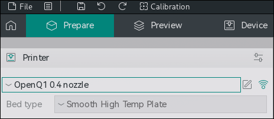
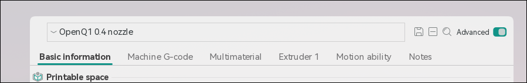
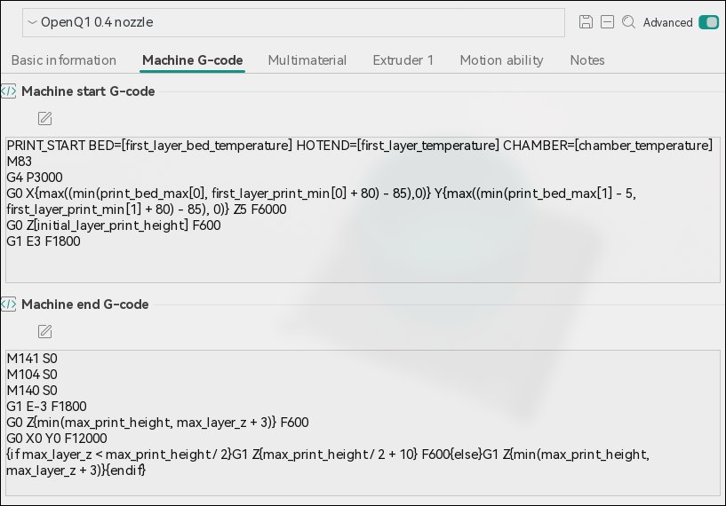
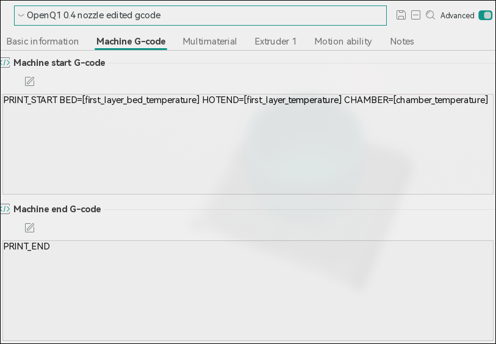

# Slicer Setup

This document contains some recommended changes to slicer settings to improve the printing experience.

## OrcaSlicer

When using OpenQ1, it is recommended to change the Machine Start and Machine End G-Codes.
OpenQ1 changes the order of the PRINT_START macro to simplify it and make it take less time.
This can result in unexpected or undesired behavior in when used with the default slicer setup, such as causing the nozzle to ooze on the bed before printing starts.
The default settings for the Q1 Pro do not call the "PRINT_END" gcode by default, at all.
This can also lead to some undesired behavior, such as the motors remaining powered after printing ends, or manually enabled fans not shutting off.

1. Open a project in OrcaSlicer, and click the edit button next to the printer selection drop down:
   
2. Enable the "Advanced" settings switch in the top right of the settings window:
   
3. Click on the "Machine G-code" tab, it should look like:
   
4. Change the settings to match these:

- Machine start G-code: `PRINT_START BED=[first_layer_bed_temperature] HOTEND=[first_layer_temperature] CHAMBER=[chamber_temperature]`
- Machine end G-code: `PRINT_END`
- Pause G-code: `PAUSE`
  

5. Click the save icon in the top right of the settings window.
